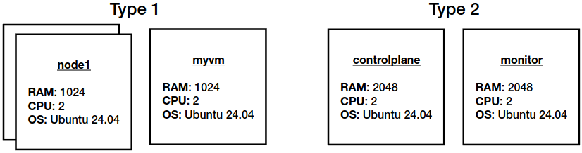

## 0. The Cloud environment
My pc.

| Spec. |        Detail         |
| :---  |        :---:          |
| OS    | Ubuntu 24.04.1 LTS    |
| CPU   | Intel® Core™ i3-9100F |
| RAM   | 16.0 GiB              |

## 1. The goal of our infrastructure
Use Vagrant to create and configure 5 VMware virtual machines.

### 1.1 Registration 
https://profile.broadcom.com/web/registration

### 1.2 VMware Workstation Pro 17.0 for Personal USe
> choose the most recent version

a) Download at https://support.broadcom.com/group/ecx/productdownloads?subfamily=VMware+Workstation+Pro ;

b) Install;
> $ chmod +x &lt;file&gt;
>
> $ sudo ./&lt;file&gt;

### 1.3 Vagrant installation
> $ sudo apt install vagrant

> $ sudo apt install vagrant-vmware-utility
>
> $ vagrant plugin install vagrant-vmware-desktop
>
> $ vagrant plugin update vagrant-vmware-desktop
