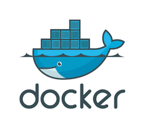

# 1. Introduction

<!--  -->

In this lesson we will take a more suitable approach to the matter of deployment itself.

Nowadays, in order to deploy an application, its deployment follow a containerized form. In this containerized form, the DevOp writes a standalone script in order to get the application ongoing, with all it's dependencies ─ requirments.

Nonetheless, this isn't enough. The DevOp shall (1) certificate that, in fact, the Docker software is installed in the machine, and (2) apply some configurations, which led to further tasks that a container can not support. It is where Ansible software come along.

Ansible is a tool to orchestration all the pre, and post required intervenience besides the container deployment itself.

## 1.1 Container
A container it is the most lightweight form of environment in order to run an application in its independent self form [^1]. A container feeds himself from the host machine (operative system, and hardware) [^1].

Appart from that, the container context is uniquely known to itself [^2]. Two containers in the same host, know nothing about each others existence ─ that both are hosted in the same host machine, what's the amount of resource consumption from each other, their context, etc.

## 1.2 Docker
<!--## 1.2 Docker -->
*Learning...*

## 1.3 Ansible
<!--## 1.3 Ansible -->
*Learning...*

<!--# 2. IaaS
*Learning...*

# 3. DevOp
*Learning...*-->

<!--References-->
[^1]: The Docker webpage, at "What is a container?" resources. Accessed from https://www.docker.com/resources/what-container/ .

[^2]: "What is a container?", p.7 from "Guide 2 Docker & Ansible", 2024-2025.

[^3]: Docker installation, at https://docs.docker.com/engine/install/ubuntu/#install-using-the-repository .
[^4]: Docker, remove sudo authentication from it, at https://docs.docker.com/engine/install/linux-postinstall/#manage-docker-as-a-non-root-user .
